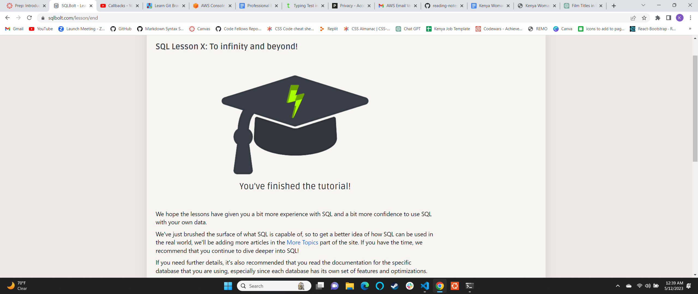

# reading-notes

## My reading journal for Code Fellows

**My name is Kenya and I am excited about learning JavaScript!!!**

Growth mindset to me means that I should always stay focused on the bigger picture and to not get so discouraged that I lose sight of my goal.

Reminders to myself to stay in a growth mindset are:

- *Never stop learning*
- *Never give up*
- *Remember my 'Why"*

[click here to go to my website](https://github.com/kenyawomack)

## Table Of Contents

### Code 102 Reading Notes

- [Link to Class 1](102notes/class1.md)
- [Link to Class 2](102notes/class2.md)
- [Link to Class 3](102notes/class3.md)
- [Link to Class 4](102notes/class4.md)
- [Link to Class 5](102notes/class5.md)
- [Link to Class 6](102notes/class6.md)
- [Link to Class 7](102notes/class7.md)
- [Link to Class 8](102notes/class8.md)

### Code 201 Reading Notes

- [Link to Class 1](201notes/class1.md)
- [Link to Class 2](201notes/class2.md)
- [Link to Class 3](201notes/class3.md)
- [Link to Class 4](201notes/class4.md)
- [Link to Class 5](201notes/class5.md)
- [Link to Class 6](201notes/class6.md)
- [Link to Class 7](201notes/class7.md)
- [Link to Class 8](201notes/class8.md)
- [Link to Class 9](201notes/class9.md)
- [Link to Class 10](201notes/class10.md)
- [Link to Class 11](201notes/class11.md)
- [Link to Class 12](201notes/class12.md)
- [Link to Class 13](201notes/class13.md)
- [Link to Class 14](201notes/class14.md)
- [Link to Class 15](201notes/class15.md)

### Code 301 Reading Notes

- [Link to Class 1](301notes/class1.md)
- [Link to Class 2](301notes/class2.md)
- [Link to Class 3](301notes/class3.md)
- [Link to Class 4](301notes/class4.md)
- [Link to Class 5](301notes/class5.md)
- [Link to Class 6](301notes/class6.md)
- [Link to Class 7](301notes/class7.md)
- [Link to Class 8](301notes/class8.md)
- [Link to Class 9](301notes/class9.md)
- [Link to Class 10](301notes/class10.md)
- [Link to Class 11](301notes/class11.md)
- [Link to Class 12](301notes/class12.md)
- [Link to Class 13](301notes/class13.md)
- [Link to Class 14](301notes/class14.md)
- [Link to Class 15](301notes/class15.md)

### Code 401 Reading Notes

- [Link to Class 1](401notes/class1.md)
- [Link to Class 2](401notes/class2.md)
- [Link to Class 3](401notes/class3.md)
- [Link to Class 4](401notes/class4.md)
- [Link to Class 5](401notes/class5.md)
- [Link to Class 6](401notes/class6.md)
- [Link to Class 7](401notes/class7.md)
- [Link to Class 8](401notes/class8.md)
- [Link to Class 9](401notes/class9.md)
- [Link to Class 10](401notes/class10.md)
- [Link to Class 11](401notes/class11.md)
- [Link to Class 12](401notes/class12.md)
- [Link to Class 13](401notes/class13.md)
- [Link to Class 14](401notes/class14.md)
- [Link to Class 15](401notes/class15.md)
- [Link to Class 16](401notes/class16.md)
- [Link to Class 17](401notes/class17.md)
- [Link to Class 18](401notes/class18.md)
- [Link to Class 19](401notes/class19.md)
- [Link to Class 20](401notes/class20.md)
- [Link to Class 21](401notes/class21.md)
- [Link to Class 22](401notes/class22.md)
- [Link to Class 23](401notes/class23.md)
- [Link to Class 24](401notes/class24.md)
- [Link to Class 25](401notes/class25.md)
- [Link to Class 26](401notes/class26.md)
- [Link to Class 27](401notes/class27.md.)
- [Link to Class 28](401notes/class28.md)
- [Link to Class 29](401notes/class29.md)
- [Link to Class 30](401notes/class30.md)
- [Link to Class 31](401notes/class31.md)
- [Link to Class 32](401notes/class32.md)
- [Link to Class 33](401notes/class33.md)
- [Link to Class 34](401notes/class34.md)
- [Link to Class 35](401notes/class35.md)
- [Link to Class 36](401notes/class36.md)
- [Link to Class 37](401notes/class37.md)
- [Link to Class 38](401notes/class38.md.)
- [Link to Class 39](401notes/class39.md)
- [Link to Class 40](401notes/class40.md)
- [Link to Class 41](401notes/class41.md)
- [Link to Class 42](401notes/class42.md)
- [Link to Class 43](401notes/class43.md)
- [Link to growthmindset](401notes/growthmindset.md)
- [Link to SQL](401notes/SQL.md)
- [Link to terminalpractices](401notes/terminalpractices.md)

